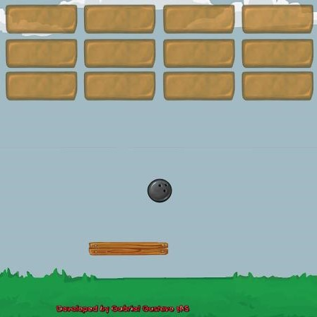

Arkanoid
---

## Jogo construído utilizando o Unity Engine

A fins de estudos, desenvolvi meu primeiro jogo utilizando Unity. Ele foi baseado em um jogo de mesmo nome [Arkanoid](https://pt.wikipedia.org/wiki/Arkanoid) desenvolvido em 1986, que por sua vez, fora baseado em outro game chamado Brekout, jogo lançado pela Atari em 1976.

Motivação
---------
Sempre tive a curiosidade de descobrir como os jogos são feitos. Desse modo, acabei me deparando com o Unity, uma ferramenta que me possibilitou descobrir mais sobre "bastidores" de desenvolvimento de jogos e ainda, exercitar meus conhecimentos em C#.

Jogue a versão web
------------------

Criei uma versão para web que está disponível em [simmer.io](https://simmer.io/@GabrielMS/arkanoid).

